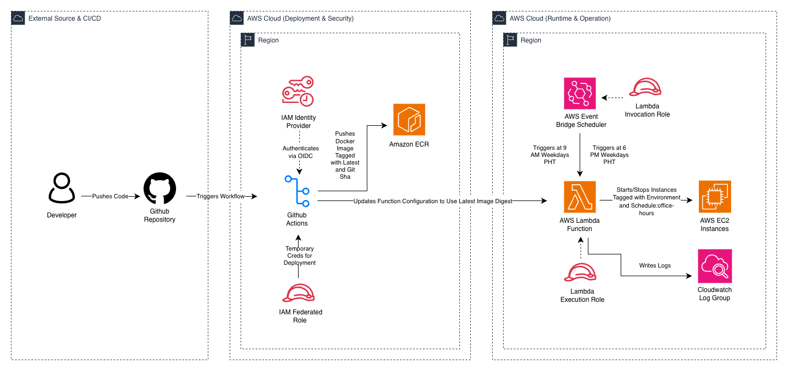

# Project: Serverless Office Hours Instance Scheduler

A serverless solution to automatically START and STOP EC2 instances based on a schedule. This project is specifically optimized for teams working in the Philippine Timezone (PHT) to reduce AWS costs by shutting down development environments outside of office hours.

## Architecture

This project uses a layered CloudFormation approach to deploy a containerized
serverless event-driven architecture of centralized scheduler triggers a compute logic that interacts with the EC2 API

## Technologies

| Component         | Service               | Purpose                                          |
| :---------------- | :-------------------- | :----------------------------------------------- |
| **Orchestration** | EventBridge Scheduler | Triggers actions at 09:00 and 18:00 PHT.         |
| **Compute**       | AWS Lambda            | Executes the Python logic to change EC2 states.  |
| **Registry**      | Amazon ECR            | Stores the Docker image for the Lambda function. |
| **Monitoring**    | CloudWatch Logs       | Stores execution logs with a 14-day retention.   |
| **CI/CD**         | GitHub Actions        | Automates testing, building, and deployment.     |

### Component Ownership

The project is divided into distinct infrastructure layers to ensure a modular deployment and a clear separation of concerns across the automation lifecycle.

- **Registry (Core Layer)**: Contains the Amazon ECR Repository. As a foundational resource, it is managed at the core level to provide a persistent, long-term storage location for the containerized Lambda images used across different environments.
- **Identity & Access (Project Layer)**: Defines the foundational security boundaries. It includes the Lambda Execution Role (permitting EC2 state changes) and the Scheduler Invoker Role (permitting EventBridge to trigger the Lambda).
- **Monitoring (Project Layer)**: Establishes the CloudWatch Log Group with a 14-day retention policy. This layer is responsible for capturing execution logs and providing visibility into automated state changes.
- **Compute (Project Layer)**: The "brain" of the scheduler. It defines the Lambda Function (running the Python logic) and its connection to the Amazon ECR repository for containerized deployments.
- **Automation (Project Layer)**: Contains the EventBridge Scheduler rules. These are configured with Asia/Manila (PHT) timezone settings to natively trigger the START/STOP actions at 9:00 AM and 6:00 PM.

